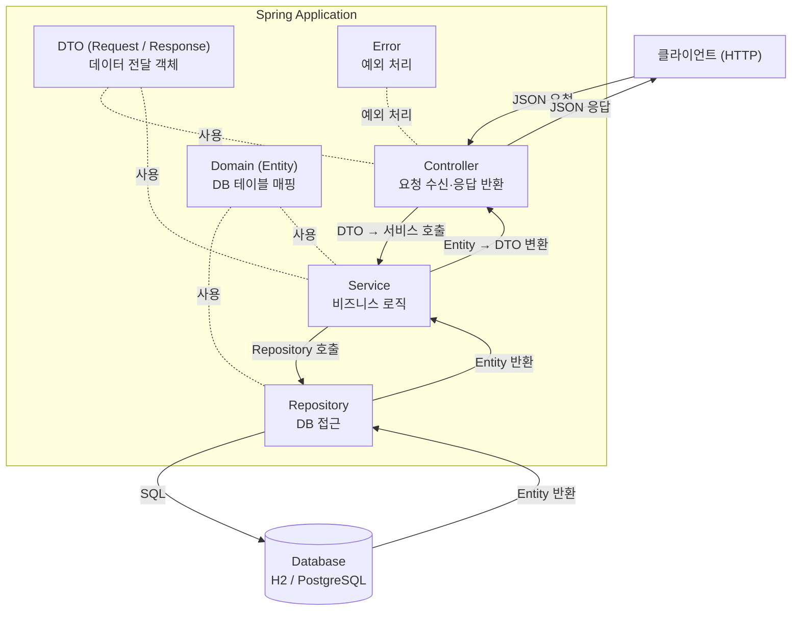
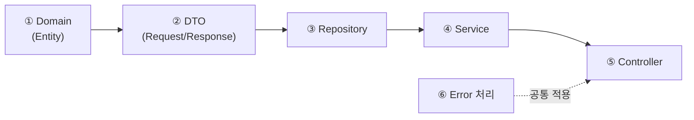
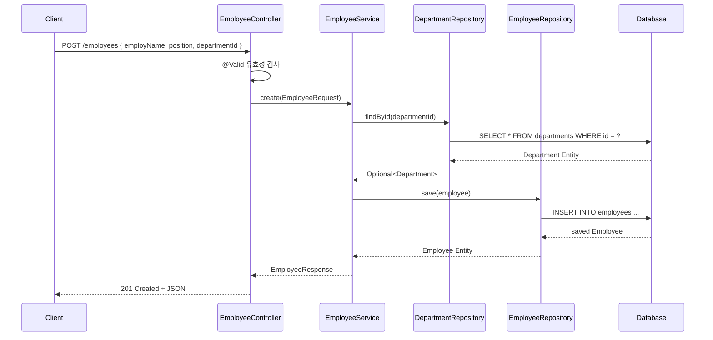

# Spring Boot API 개발 가이드

Spring Boot + JPA 환경에서 REST API를 만들 때의 작업 순서와 각 계층의 역할을 정리한 문서입니다.  
이 프로젝트의 실제 코드(User, Department, Employee)를 기준으로 설명합니다.

---

## 전체 아키텍처



---

## 개발 순서



> Domain → DTO → Repository → Service → Controller 순으로 안쪽(DB)부터 바깥(HTTP)으로 만든다.

---

## 각 단계 상세

### ① Domain (Entity)

DB 테이블과 1:1로 매핑되는 클래스. **가장 먼저** 설계한다.

```
src/main/java/.../domain/
├── Department.java
├── Employee.java
└── User.java
```

**핵심 어노테이션**

| 어노테이션 | 역할 |
|---|---|
| `@Entity` | JPA가 관리하는 테이블 매핑 |
| `@Table(name = "...")` | 실제 테이블 이름 지정 |
| `@Id` + `@GeneratedValue` | PK 자동 증가 |
| `@Column(...)` | 컬럼 제약조건 (nullable, length 등) |
| `@ManyToOne` / `@OneToMany` | 테이블 간 연관관계 |

**이 프로젝트 예시 (Employee)**

```java
@Entity
@Table(name = "employees")
@Getter @NoArgsConstructor(access = AccessLevel.PROTECTED) @AllArgsConstructor @Builder
public class Employee {

    @Id @GeneratedValue(strategy = GenerationType.IDENTITY)
    private Long id;

    @Column(nullable = false, length = 50)
    private String name;

    @ManyToOne(fetch = FetchType.LAZY)  // N:1 — 직원 여럿이 부서 하나에 속함
    @JoinColumn(name = "department_id")
    private Department department;

    @CreationTimestamp
    @Column(nullable = false, updatable = false)
    private LocalDateTime createdAt;
}
```

**설계 포인트**
- Lombok `@Builder` + `@NoArgsConstructor(PROTECTED)` 조합으로 무결한 객체 생성 강제
- 연관관계는 `FetchType.LAZY`를 기본값으로 (N+1 문제 예방)
- 수정 불가 필드는 `updatable = false`

---

### ② DTO (Request / Response)

Controller와 외부 사이에서 데이터를 주고받는 객체. Domain을 직접 노출하지 않기 위해 사용한다.

```
src/main/java/.../dto/
├── DepartmentRequest.java   ← 클라이언트 → 서버
├── DepartmentResponse.java  ← 서버 → 클라이언트
├── EmployeeRequest.java
└── EmployeeResponse.java
```

**Request** — 입력값 검증 + Entity 변환 담당

```java
public record DepartmentRequest(
        @NotBlank String departmentName   // 유효성 검사
) {
    public Department toEntity() {        // DTO → Entity 변환
        return Department.builder().name(departmentName).build();
    }
}
```

**Response** — Entity → 응답 형태로 변환 담당

```java
public record DepartmentResponse(Long departmentId, String departmentName) {
    public static DepartmentResponse from(Department d) {   // Entity → DTO 변환
        return new DepartmentResponse(d.getId(), d.getName());
    }
}
```

**설계 포인트**
- Java `record` 사용 → getter·equals·hashCode 자동 생성, 불변 객체
- `toEntity()` / `from()` 변환 메서드를 DTO 안에 위치시켜 변환 책임 명확화
- `@NotBlank`, `@NotNull` 등으로 Controller 진입 전 유효성 검사

---

### ③ Repository

DB 쿼리를 담당하는 인터페이스. `JpaRepository`를 상속하면 기본 CRUD가 자동 제공된다.

```
src/main/java/.../repository/
├── DepartmentRepository.java
├── EmployeeRepository.java
└── UserRepository.java
```

```java
public interface DepartmentRepository extends JpaRepository<Department, Long> {
    // 기본 제공: save, findById, findAll, existsById, deleteById ...
}
```

추가 쿼리가 필요하면 메서드명 규칙으로 자동 생성된다.

```java
// 예시 — 필요한 경우에만 추가
Optional<User> findByUsername(String username);
boolean existsByUsername(String username);
```

**JpaRepository 기본 제공 메서드**

| 메서드 | SQL |
|---|---|
| `findAll()` | SELECT * |
| `findById(id)` | SELECT * WHERE id = ? |
| `save(entity)` | INSERT / UPDATE |
| `existsById(id)` | SELECT COUNT(*) |
| `deleteById(id)` | DELETE WHERE id = ? |

---

### ④ Service

비즈니스 로직과 트랜잭션을 담당한다. Controller와 Repository 사이의 중간 계층.

```
src/main/java/.../service/
├── DepartmentService.java
├── EmployeeService.java
└── UserService.java
```

```java
@Service
@RequiredArgsConstructor
public class DepartmentService {

    private final DepartmentRepository departmentRepository;

    @Transactional(readOnly = true)   // 조회는 readOnly
    public List<DepartmentResponse> findAll() {
        return departmentRepository.findAll().stream()
                .map(DepartmentResponse::from).toList();
    }

    @Transactional                    // 변경은 일반 트랜잭션
    public DepartmentResponse create(DepartmentRequest req) {
        return DepartmentResponse.from(departmentRepository.save(req.toEntity()));
    }
}
```

**설계 포인트**
- `@Transactional(readOnly = true)` — 조회 전용 트랜잭션 (성능 최적화)
- `@Transactional` — 생성·수정·삭제는 커밋/롤백 보장
- Entity는 Service에서 DTO로 변환 후 반환 (Controller에 Entity 직접 노출 금지)
- 연관 Entity 조회가 필요한 경우 (Employee ↔ Department) Service가 두 Repository를 모두 주입받아 처리

---

### ⑤ Controller

HTTP 요청을 받아 Service를 호출하고 응답을 반환한다.

```
src/main/java/.../controller/
├── DepartmentController.java
├── EmployeeController.java
└── UserController.java
```

```java
@RestController
@RequestMapping("/departments")
@RequiredArgsConstructor
public class DepartmentController {

    private final DepartmentService departmentService;

    @GetMapping             public List<DepartmentResponse> list() { ... }
    @GetMapping("/{id}")    public DepartmentResponse get(@PathVariable Long id) { ... }
    @PostMapping            public ResponseEntity<DepartmentResponse> create(...) { ... }
    @PutMapping("/{id}")    public DepartmentResponse update(...) { ... }
    @DeleteMapping("/{id}") public ResponseEntity<Void> delete(...) { ... }
}
```

**HTTP 메서드 ↔ CRUD 매핑**

| HTTP | 어노테이션 | 동작 | 응답 코드 |
|---|---|---|---|
| GET | `@GetMapping` | 조회 | 200 OK |
| POST | `@PostMapping` | 생성 | 201 Created |
| PUT | `@PutMapping` | 수정 | 200 OK |
| DELETE | `@DeleteMapping` | 삭제 | 204 No Content |

**설계 포인트**
- `@Valid` — Request DTO의 유효성 검사 활성화
- 생성 시 `ResponseEntity.created(URI)` 로 Location 헤더 포함
- 없는 리소스 접근 시 `NotFoundException` throw → GlobalExceptionHandler가 404 반환

---

### ⑥ Error 처리

전역 예외 처리는 `@RestControllerAdvice`로 한 곳에서 관리한다.

```
src/main/java/.../error/
├── NotFoundException.java        ← 커스텀 예외
├── ErrorResponse.java            ← 에러 응답 형태
└── GlobalExceptionHandler.java   ← 전역 처리
```

```java
// 예외 발생
throw NotFoundException.of("department", id);

// GlobalExceptionHandler가 자동으로 잡아서 JSON으로 반환
// { "code": "NOT_FOUND", "message": "department not found: 99" }
```

---

## 요청 흐름 (Employee 생성 예시)



---

## 파일 구조 한눈에 보기

```
src/main/java/.../
│
├── domain/          ① Entity 클래스 (DB 테이블)
│   ├── Department.java
│   └── Employee.java
│
├── dto/             ② 요청·응답 데이터 객체
│   ├── DepartmentRequest.java
│   ├── DepartmentResponse.java
│   ├── EmployeeRequest.java
│   └── EmployeeResponse.java
│
├── repository/      ③ DB 접근 인터페이스
│   ├── DepartmentRepository.java
│   └── EmployeeRepository.java
│
├── service/         ④ 비즈니스 로직 + 트랜잭션
│   ├── DepartmentService.java
│   └── EmployeeService.java
│
├── controller/      ⑤ HTTP 엔드포인트
│   ├── DepartmentController.java
│   └── EmployeeController.java
│
└── error/           ⑥ 공통 예외 처리
    ├── NotFoundException.java
    ├── ErrorResponse.java
    └── GlobalExceptionHandler.java
```

---

## 체크리스트

새 도메인을 추가할 때 순서대로 확인한다.

- [ ] **Domain** — 필드, 제약조건, 연관관계 설계
- [ ] **DTO Request** — 입력값 유효성 검사 + `toEntity()` 작성
- [ ] **DTO Response** — 응답 필드 선택 + `from()` 작성
- [ ] **Repository** — `JpaRepository` 상속, 필요한 쿼리 메서드 추가
- [ ] **Service** — 트랜잭션 범위 설정, 비즈니스 로직 작성
- [ ] **Controller** — URL 설계, HTTP 메서드 매핑, 응답 코드 확인
- [ ] **예외 처리** — 없는 리소스 접근 시 적절한 예외 throw
